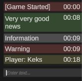
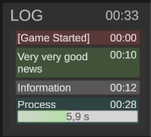
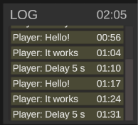

v0.2
---------------------
This **Log** allows you to notify the user about events occurring during the game.

Capabilities:
* Display a message with positive news (AddGoodNews (text)).
* Display an informational message (AddInformation (text)).
* Display a warning message (AddWarning (text)).
* Output the process (AddProcess (name, duration)).
* Sending messages (opening a chat, sending a message - Enter) (so far only an offline version).
* Antispam.
* Session time output.
* The ability to save log entries by date either in the project folder, or along the path Users / Username / AppData / LocalLow / CompanyName / ProjectName /.

There are 2 versions of the log in the project.

MiniLog (LogPanelv2)
---------------------
Large panel with full functionality.
Scroll using a slider or swipe.
Better suited for installation in the lower right corner of the canvas.

BigLog (LogPanelv1)
---------------------
A smaller version with a transparent background and without the possibility of output processes.
Scrolling by scrolling.
Best suited for installation along the upper edge of the canvas.

